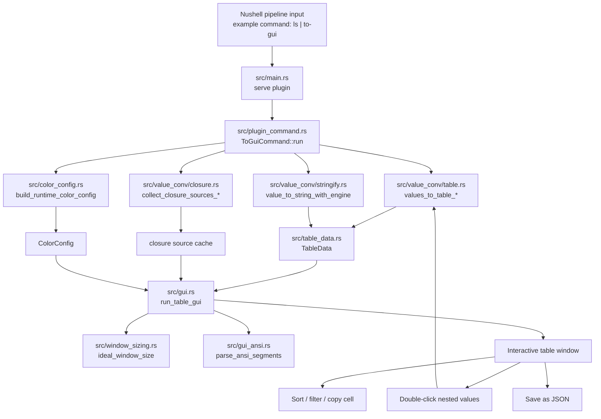

# nu_plugin_to_gui

`nu_plugin_to_gui` is a small Rust utility that bridges Nushell plugins and a graphical user interface. It pulls in necessary Nushell crates (plugin, protocol, color-config, utils) and exposes a simple GUI built with `gpui` components.

The intent is to show the output of Nushell commands in a GUI.

## User Features

- Open Nushell pipeline output in a desktop table UI with `to-gui`.
- Works with table, record, and mixed structured data.
- Auto-generates columns/rows from incoming data shape.
- Auto-transposes a single record into key/value rows for readability.
- Disable transpose behavior with `--no-transpose`.
- Auto-sizes columns to content by default.
- Disable auto-size with `--no-autosize`.
- Sort by columns directly in the table.
- Filter data globally and per-column.
- Use filter operators like `is:`, `contains:`, `starts-with:`, and `ends-with:` on the column headers.
- Provide an initial global filter using `--filter`.
- Drill into nested records/lists by double-clicking cells.
- Navigate back from nested views with the in-window Back control.
- Preserve and display many Nushell value types cleanly (including nested values).
- Optional RFC3339 datetime formatting with `--rfc3339`.
- Apply Nushell color configuration to table cells and headers.
- Respect `LS_COLORS` for file-like/table views where applicable.
- Render ANSI-colored text content in cells.
- Right-click any cell and copy that specific value.
- Access top-level app menus (File, Edit, View, Options, Window, Help).
- Save table output to JSON from the GUI.
- Open data quickly from common Nushell workflows like `ls | to-gui` and `$env.config | to-gui`.
- Start with a window size that adapts to table dimensions.

## Project Layout

- `src/main.rs`: plugin binary entrypoint (serves the Nushell plugin).
- `src/lib.rs`: crate root that wires modules and public exports.
- `src/plugin_command.rs`: `to-gui` command definition and Nushell plugin integration.
- `src/color_config.rs`: user-facing color behavior (`color_config`, `LS_COLORS`, style resolution).
- `src/color_utils.rs`: shared color/style helper utilities.
- `src/table_data.rs`: shared table model passed between conversion and GUI layers.
- `src/value_conv/`: Nushell value conversion pipeline.
	- `mod.rs`: public conversion API and tests.
	- `closure.rs`: closure source extraction/highlighting helpers.
	- `stringify.rs`: value-to-display-string conversion.
	- `table.rs`: table-shaping logic from incoming pipeline data.
- `src/gui.rs`: primary GUI view/delegate, interactions, and app runtime glue.
- `src/gui_ansi.rs`: ANSI segment parsing for colored text rendering in cells.
- `src/window_sizing.rs`: initial window-size calculation logic.
- `tests/plugin.rs`: integration tests for plugin command metadata/signature.

## Data Flow

## Getting Started

1. Clone the repository and ensure you have Rust installed (edition 2024).
2. Run `cargo build` to compile the project or `cargo install --path .`. Dependencies are fetched from the Nushell GitHub repo.
3. Register the plugin with `plugin add /path/to/nu_plugin_to_gui`.
4. Restart or use the plugin with `plugin use /path/to/nu_plugin_to_gui`
5. Try it out `ls | to-gui`

_Note:_ the project is in early development and primarily intended for internal tooling or experimentation.

Feel free to open issues or contribute enhancements.
