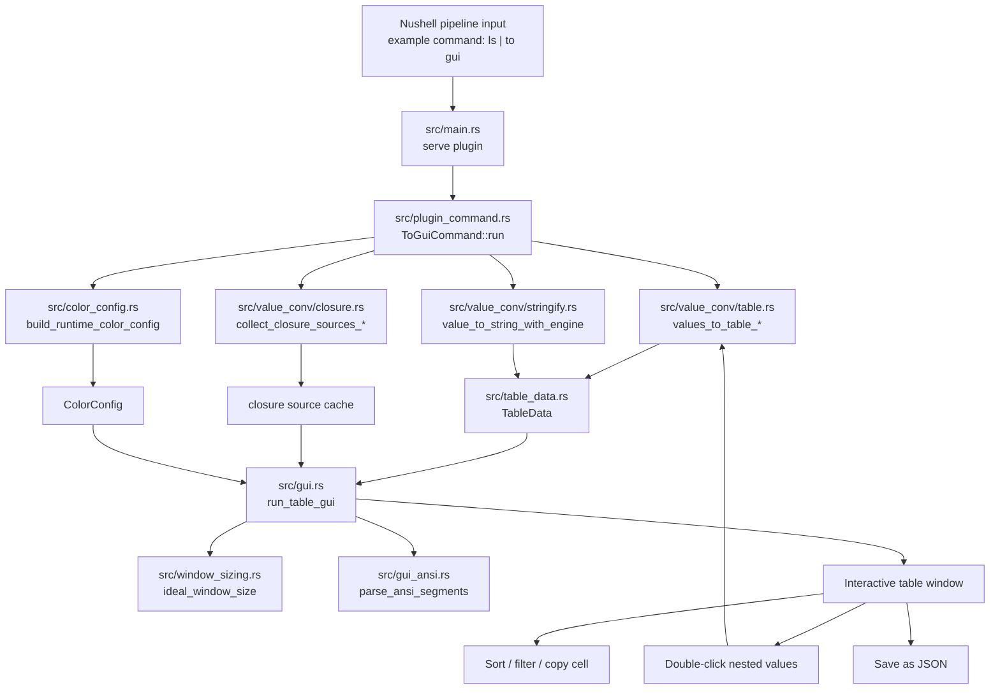

# nu_plugin_to_gui

`nu_plugin_to_gui` is a small Rust utility that bridges Nushell plugins and a graphical user interface. It pulls in necessary Nushell crates (plugin, protocol, color-config, utils) and exposes a simple GUI built with `gpui` components.

The intent is to show the output of Nushell commands in a GUI.

## User Features

- Open Nushell pipeline output in a desktop table UI with `to gui`.
- Works with table, record, and mixed structured data.
- Auto-generates columns/rows from incoming data shape.
- Auto-transposes a single record into key/value rows for readability.
- Disable transpose behavior with `--no-transpose`.
- Auto-sizes columns to content by default.
- Disable auto-size with `--no-autosize`.
- Sort by columns directly in the table.
- Filter data globally and per-column.
- Toggle per-column filters in the headers (title-bar filter button or `Cmd/Ctrl+Shift+F`) and use operators like `is:`, `contains:`, `starts-with:`, and `ends-with:`.
- Provide an initial global filter using `--filter`.
- Drill into nested records/lists by double-clicking cells.
- Navigate nested views with Back/Forward buttons (`Cmd/Ctrl+[` / `Cmd/Ctrl+]`) and a clickable breadcrumb path.
- Preserve and display many Nushell value types cleanly (including nested values).
- Optional RFC3339 datetime formatting with `--rfc3339`.
- Apply Nushell color configuration to table cells and headers.
- Respect `LS_COLORS` for file-like/table views where applicable.
- Keep text readable: colors too dark for the background (e.g. `blue` or `black` on the dark theme) are lightened to a 4.5:1 contrast ratio, keeping their hue. `LS_COLORS` backgrounds, such as the README highlight, are drawn behind the file name.
- Render ANSI-colored text content in cells.
- Right-click any cell and copy that specific value.
- Native macOS menus and keyboard shortcuts: Save As (`Cmd/Ctrl+S`), Find (`Cmd/Ctrl+F`), Copy selection (`Cmd/Ctrl+C`), Close Window (`Cmd/Ctrl+W`).
- Status bar with row/column counts, filtered-row count, and the selected row.
- Adjustable font size (`Cmd/Ctrl+=`, `Cmd/Ctrl+-`, `Cmd/Ctrl+0`, or the status-bar control), with the startup size set in `config.nu`.
- Save table output to JSON from the GUI.
- Open data quickly from common Nushell workflows like `ls | to gui` and `$env.config | to gui`.
- Start with a window size that adapts to table dimensions.

## Configuration

`to gui` reads its settings from `$env.config.plugins.to_gui` in `config.nu`:

```nu
$env.config.plugins.to_gui = {
    font_size: 18  # base UI font size in pixels, 10-28 (default 16)
}
```

Changing the font size inside the window lasts for that window. When it differs
from the configured size, the status bar shows **Copy setting**, which copies the
matching `config.nu` line to the clipboard.

## Project Layout

- `src/main.rs`: plugin binary entrypoint (serves the Nushell plugin).
- `src/lib.rs`: crate root that wires modules and public exports.
- `src/plugin_command.rs`: `to gui` command definition and Nushell plugin integration.
- `src/color_config.rs`: user-facing color behavior (`color_config`, `LS_COLORS`, style resolution).
- `src/color_utils.rs`: shared color/style helper utilities.
- `src/table_data.rs`: shared table model passed between conversion and GUI layers.
- `src/value_conv/`: Nushell value conversion pipeline.
	- `mod.rs`: public conversion API and tests.
	- `closure.rs`: closure source extraction/highlighting helpers.
	- `stringify.rs`: value-to-display-string conversion.
	- `table.rs`: table-shaping logic from incoming pipeline data.
- `src/gui.rs`: primary GUI view/delegate, interactions, and app runtime glue.
- `src/gui_ansi.rs`: ANSI segment parsing for colored text rendering in cells.
- `src/settings.rs`: plugin settings read from `$env.config.plugins.to_gui`.
- `src/window_sizing.rs`: font-scaled sizing for the window, title bar, rows, and columns.
- `tests/plugin.rs`: integration tests for plugin command metadata/signature.
- `examples/snapshot.rs`: renders the window offscreen to a PNG with sample data
  (`cargo run --example snapshot --features snapshot -- out.png`).

## Data Flow


```mermaid
flowchart TD
	A["Nushell pipeline input<br/>example command: ls | to gui"] --> B[src/main.rs<br/>serve plugin]
	B --> C[src/plugin_command.rs<br/>ToGuiCommand::run]

	C --> D[src/value_conv/table.rs<br/>values_to_table_*]
	C --> E[src/value_conv/stringify.rs<br/>value_to_string_with_engine]
	C --> F[src/value_conv/closure.rs<br/>collect_closure_sources_*]
	C --> G[src/color_config.rs<br/>build_runtime_color_config]

	D --> H[src/table_data.rs<br/>TableData]
	E --> H
	F --> I[closure source cache]
	G --> J[ColorConfig]

	H --> K[src/gui.rs<br/>run_table_gui]
	I --> K
	J --> K

	K --> L[src/window_sizing.rs<br/>ideal_window_size]
	K --> M[src/gui_ansi.rs<br/>parse_ansi_segments]
	K --> N[Interactive table window]

	N --> O[Sort / filter / copy cell]
	N --> P[Double-click nested values]
	P --> D
	N --> Q[Save as JSON]
```

## Getting Started

### Platform prerequisites

#### Linux

On Linux and FreeBSD, the build performs an early dependency check and reports missing GUI system libraries with installation hints.

If both `WAYLAND_DISPLAY` and `DISPLAY` are present and Wayland initialization fails, `to gui` automatically retries with X11. Set `TO_GUI_FORCE_WAYLAND=1` to disable this fallback.

- install development packages for XCB and XKB before building.
	- Debian/Ubuntu: `sudo apt install libxcb1-dev libxkbcommon-dev libxkbcommon-x11-dev`
	- Fedora: `sudo dnf install libxcb-devel libxkbcommon-devel libxkbcommon-x11-devel`
	- Arch: `sudo pacman -S libxcb libxkbcommon xorg-xkbcommon`

#### MacOS

On macOS, this project enables `gpui` runtime shader compilation (`runtime_shaders`) to avoid requiring the separate Metal Toolchain component during `cargo build`.

	- Install Xcode Command Line Tools: `xcode-select --install`
	- If prompted, open Xcode once and accept the license.

#### Windows
- use the MSVC Rust target (`x86_64-pc-windows-msvc`) with Visual Studio Build Tools.

### Building
1. Clone the repository and ensure you have Rust installed (edition 2024).
2. Run `cargo build` to compile the project or `cargo install --path .`. Dependencies are fetched from the Nushell GitHub repo.
3. Register the plugin with `plugin add /path/to/nu_plugin_to_gui`.
4. Restart or use the plugin with `plugin use /path/to/nu_plugin_to_gui`
5. Try it out `ls | to gui`

`to gui` launches the window asynchronously: Nushell returns to the prompt immediately while the GUI stays open in its own app event loop.

_Note:_ the project is in early development and primarily intended for internal tooling or experimentation.


Feel free to open issues or contribute enhancements.
